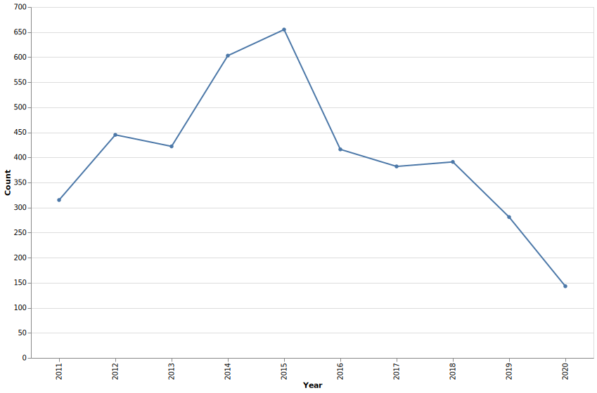
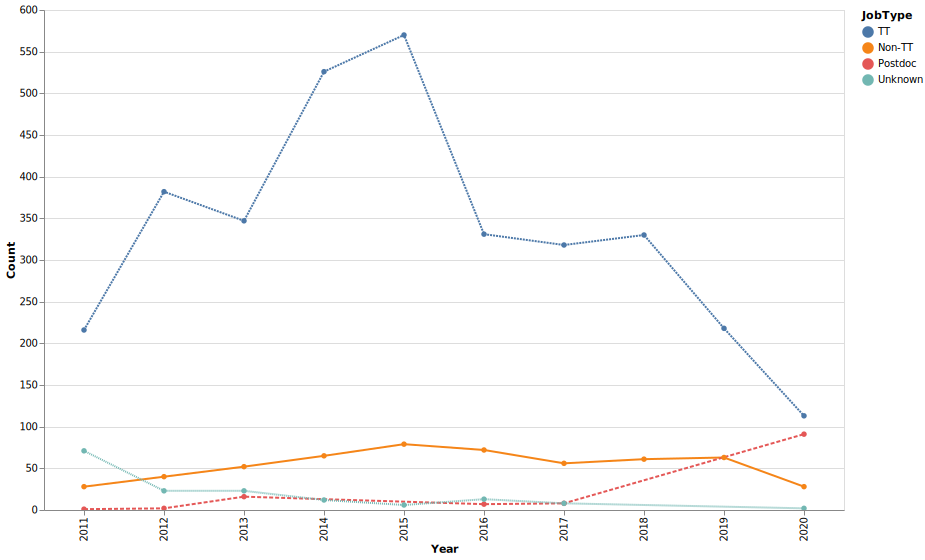
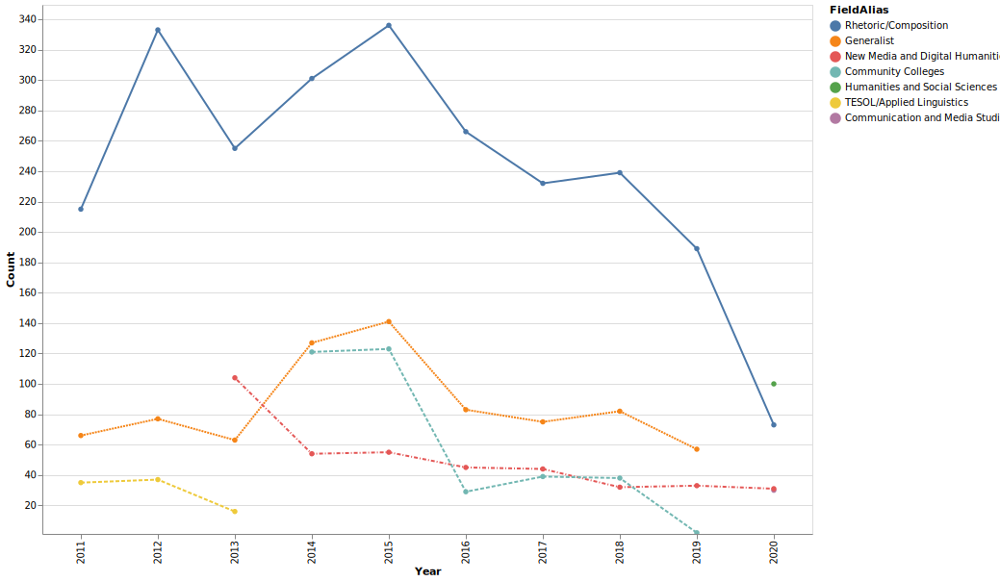

# Job Census

Modified code from Ryan Heuser's [jobcensus](https://github.com/quadrismegistus/jobcensus) project for English Studies. FYI, I am still modifying the code to be better suited to this discipline's needs, 

How many jobs are offered each year in Rhetoric and Composition? This "census" is meant to be an informal count of the jobs advertised each year by using the [Academic Jobs Wiki](https://academicjobs.wikia.org/) as its primary source.

These data compile the jobs listed in the Jobs Wiki for every year since 2011; for this year (2020) only. The data is described [here](#data), and the code used to gather it is described [here](#code).

## Results

Bear in mind with the following graphs: the last data point, for 2020, is not like the others! This represents the number of jobs advertised for the 2020-2021 season *so far* (as of 11/23/2020). We're fairly far into the season, but it's by no means over yet.

### Number of jobs overall

### Number of jobs by type

### Number of jobs by field

## Code

1. [Run the numbers on the Wiki](wiki/wiki_jobcensus.ipynb)

2. [Process the data](synthesis/synthesize.ipynb)

3. [Manual process: Give aliases to fields](synthesis/data.jobcensus.rc.field_aliases.csv)

4. [Plot results](plot/plotjobs.ipynb)

## Data

1. [Jobs scraped from Jobs Wiki](wiki/data.jobcensus.rc.wiki.2020-11-23.csv)

2. [Field aliases](synthesis/data.jobcensus.rc.field_aliases.csv)

## Sources

while the wiki site will scrape pages across English Studies, I reduced this set to more germane fields for our discipline.

1. [Academic Jobs Wiki](https://academicjobs.wikia.org/)
    * Pages linked to from:
        * Communication and Media Studies: [2020](https://academicjobs.wikia.org/wiki/Communication_and_Media_Studies_2020-2021) | [2020](https://academicjobs.wikia.org/wiki/Communication_and_Media_Studies_2020-2021)
        * Community Colleges: [2014](https://academicjobs.wikia.org/wiki/Community_Colleges_2014) | [2015](https://academicjobs.wikia.org/wiki/Community_Colleges_2015) | [2016](https://academicjobs.wikia.org/wiki/Community_Colleges_2016) | [2017](https://academicjobs.wikia.org/wiki/Community_Colleges_2017) | [2018](https://academicjobs.wikia.org/wiki/Community_Colleges_2018) | [2019](https://academicjobs.wikia.org/wiki/Community_Colleges_2019)
        * Drama, Speech, Film & New Media: [2011](https://academicjobs.wikia.org/wiki/Drama,_Speech,_Film_%26_New_Media_2011)
        * Generalist: [2011](https://academicjobs.wikia.org/wiki/Generalist_2011) | [2012](https://academicjobs.wikia.org/wiki/Generalist_2012) | [2013](https://academicjobs.wikia.org/wiki/Generalist_2013) | [2014](https://academicjobs.wikia.org/wiki/Generalist_2014) | [2015](https://academicjobs.wikia.org/wiki/Generalist_2015) | [2016](https://academicjobs.wikia.org/wiki/Generalist_2016) | [2017](https://academicjobs.wikia.org/wiki/Generalist_2017) | [2018](https://academicjobs.wikia.org/wiki/Generalist_2018) | [2019](https://academicjobs.wikia.org/wiki/Generalist_2019)
        * Generalist 2014#Albany State University .28GA.29 - TT Asst. Professor of: [English](https://academicjobs.wikia.org/wiki/Generalist_2014#Albany_State_University_.28GA.29_-_TT_Asst._Professor_of_English)
        * Generalist 2014#Embry-Riddle University.2C.C2.A0Daytona Beach Campus - TT.C2.A0Assistant Professor of Composition and: [Humanities.C2.A0](https://academicjobs.wikia.org/wiki/Generalist_2014#Embry-Riddle_University.2C.C2.A0Daytona_Beach_Campus_-_TT.C2.A0Assistant_Professor_of_Composition_and_Humanities.C2.A0)
        * Generalist 2014#Holy Family University .28PA.29 - Asst. Professor of: [Writing](https://academicjobs.wikia.org/wiki/Generalist_2014#Holy_Family_University_.28PA.29_-_Asst._Professor_of_Writing)
        * Generalist 2014#Holy Names University .28CA.29 - TT Asst. Professor of: [English](https://academicjobs.wikia.org/wiki/Generalist_2014#Holy_Names_University_.28CA.29_-_TT_Asst._Professor_of_English)
        * Generalist 2014#Moravian College .28PA.29 - TT Assistant Professor of: [English](https://academicjobs.wikia.org/wiki/Generalist_2014#Moravian_College_.28PA.29_-_TT_Assistant_Professor_of_English)
        * Generalist 2014#Pfeiffer University .28NC.29 - Assistant.2FAssociate Professor of: [English](https://academicjobs.wikia.org/wiki/Generalist_2014#Pfeiffer_University_.28NC.29_-_Assistant.2FAssociate_Professor_of_English)
        * Generalist 2014#William Paterson University .28NJ.29 - Assistant Professor of: [English](https://academicjobs.wikia.org/wiki/Generalist_2014#William_Paterson_University_.28NJ.29_-_Assistant_Professor_of_English)
        * Humanities and Social Sciences Postdocs: [2020](https://academicjobs.wikia.org/wiki/Humanities_and_Social_Sciences_Postdocs_2020-2021) | [2020](https://academicjobs.wikia.org/wiki/Humanities_and_Social_Sciences_Postdocs_2020-2021)
        * New Media & Digital Humanities: [2013](https://academicjobs.wikia.org/wiki/New_Media_%26_Digital_Humanities_2013)
        * New Media and Digital Humanities: [2014](https://academicjobs.wikia.org/wiki/New_Media_and_Digital_Humanities_2014) | [2015](https://academicjobs.wikia.org/wiki/New_Media_and_Digital_Humanities_2015) | [2016](https://academicjobs.wikia.org/wiki/New_Media_and_Digital_Humanities_2016) | [2017](https://academicjobs.wikia.org/wiki/New_Media_and_Digital_Humanities_2017) | [2018](https://academicjobs.wikia.org/wiki/New_Media_and_Digital_Humanities_2018) | [2019](https://academicjobs.wikia.org/wiki/New_Media_and_Digital_Humanities_2019) | [2020](https://academicjobs.wikia.org/wiki/New_Media_and_Digital_Humanities_2020)
        * New Media and Digital Humanities 2014#Clemson University .28SC.29 - Digital Rhetorics.2C Comparative Media.2C and Civic Culture .28Two TT: [Positions.29](https://academicjobs.wikia.org/wiki/New_Media_and_Digital_Humanities_2014#Clemson_University_.28SC.29_-_Digital_Rhetorics.2C_Comparative_Media.2C_and_Civic_Culture_.28Two_TT_Positions.29)
        * New Media and Digital Humanities 2014#Dakota State University - TT Asst. Professor of: [English](https://academicjobs.wikia.org/wiki/New_Media_and_Digital_Humanities_2014#Dakota_State_University_-_TT_Asst._Professor_of_English)
        * New Media and Digital Humanities 2014#Saint Joseph.27s University .28PA.29 - TT Assistant Professor of Communication and Digital Media .282: [Positions.29](https://academicjobs.wikia.org/wiki/New_Media_and_Digital_Humanities_2014#Saint_Joseph.27s_University_.28PA.29_-_TT_Assistant_Professor_of_Communication_and_Digital_Media_.282_Positions.29)
        * New Media and Digital Humanities 2014#Visiting Positions .2F: [Postdocs](https://academicjobs.wikia.org/wiki/New_Media_and_Digital_Humanities_2014#Visiting_Positions_.2F_Postdocs)
        * Queer/Women's/Gender Studies: [2012](https://academicjobs.wikia.org/wiki/Queer/Women%27s/Gender_Studies_2012) | [2015](https://academicjobs.wikia.org/wiki/Queer/Women%27s/Gender_Studies_2015)
        * Queer/Women's/Gender Studies 2014#Texas A.26M - TT Advanced Assistant Professor.2C Gender and Sexuality Studies with an Emphasis in: [Rhetoric](https://academicjobs.wikia.org/wiki/Queer/Women%27s/Gender_Studies_2014#Texas_A.26M_-_TT_Advanced_Assistant_Professor.2C_Gender_and_Sexuality_Studies_with_an_Emphasis_in_Rhetoric)
        * Renaissance: [2012](https://academicjobs.wikia.org/wiki/Renaissance_2012) | [2016](https://academicjobs.wikia.org/wiki/Renaissance_2016) | [2018](https://academicjobs.wikia.org/wiki/Renaissance_2018)
        * Rhetoric/Composition: [2011](https://academicjobs.wikia.org/wiki/Rhetoric/Composition_2011) | [2012](https://academicjobs.wikia.org/wiki/Rhetoric/Composition_2012) | [2013](https://academicjobs.wikia.org/wiki/Rhetoric/Composition_2013) | [2014](https://academicjobs.wikia.org/wiki/Rhetoric/Composition_2014) | [2015](https://academicjobs.wikia.org/wiki/Rhetoric/Composition_2015) | [2016](https://academicjobs.wikia.org/wiki/Rhetoric/Composition_2016) | [2017](https://academicjobs.wikia.org/wiki/Rhetoric/Composition_2017) | [2018](https://academicjobs.wikia.org/wiki/Rhetoric/Composition_2018) | [2019](https://academicjobs.wikia.org/wiki/Rhetoric/Composition_2019) | [2020](https://academicjobs.wikia.org/wiki/Rhetoric/Composition_2020)
        * Rhetoric/Composition Positions and Salaries: [2011](https://academicjobs.wikia.org/wiki/Rhetoric/Composition_Positions_and_Salaries_2011-12)
        * Rhetoric/Composition Salaries: [2012](https://academicjobs.wikia.org/wiki/Rhetoric/Composition_Salaries_2012-13)
        * Rhetoric/Composition Salaries for AY: [2013](https://academicjobs.wikia.org/wiki/Rhetoric/Composition_Salaries_for_AY_2013-14) | [2014](https://academicjobs.wikia.org/wiki/Rhetoric/Composition_Salaries_for_AY_2014-15) | [2015](https://academicjobs.wikia.org/wiki/Rhetoric/Composition_Salaries_for_AY_2015-16) | [2016](https://academicjobs.wikia.org/wiki/Rhetoric/Composition_Salaries_for_AY_2016-17)
        * Social Work: [2020](https://academicjobs.wikia.org/wiki/Social_Work_2020-2021)
        * TESOL / Applied Linguistics: [2012](https://academicjobs.wikia.org/wiki/TESOL_/_Applied_Linguistics_2012) | [2013](https://academicjobs.wikia.org/wiki/TESOL_/_Applied_Linguistics_2013)
        * TESOL/Applied Linguistics: [2011](https://academicjobs.wikia.org/wiki/TESOL/Applied_Linguistics_2011)
